# n8n MCP Server

> **⚠️ WARNING: ** Using this tool may **consume a large number of tokens**. Please ensure you understand the associated costs before using it.

[ English | [繁體中文](docs/README_TW.md) ]

## Table of Contents
- [Project Overview](#project-overview)
- [Project Status](#project-status)
  - [Completed Features](#completed-features)
  - [Pending Features](#pending-features)
- [Available Tools](#available-tools)
  - [Workflow Management](#workflow-management) 
  - [Execution Monitoring](#execution-monitoring)
  - [Node Discovery & Analysis](#node-discovery-and-analysis)
- [Installation & Usage](#installation-and-usage)
  - [Installation](#installation)
  - [Security Considerations](#security-considerations)
- [Technical Stack](#technical-stack)
- [Project Structure](#project-structure)
- [Contribution Guidelines](#contribution-guidelines)
- [License](#license)
- [Acknowledgments](#acknowledgments)

## Project Overview

This project establishes a Model Context Protocol (MCP) server for interaction with an n8n instance. It enables Large Language Models (LLMs) to programmatically control n8n for tasks such as:

- Automated creation and modification of n8n workflows.
- Manipulation of n8n nodes.
- Management of n8n workflow executions.

The primary objective is to allow users to direct an LLM via natural language to operate n8n, thereby simplifying and automating workflow design and management.

```mermaid
graph LR
    %% 定義 n8n API 節點（每個節點代表一組 API）
    wf[Workflows API]
    ex[Executions API]
    us[Users API]
    cr[Credentials API]
    tg[Tags API]
    pr[Projects API]
    va[Variables API]
    au[Audit API]
    sc[SourceControl API]
    
    %% 定義中樞節點與 MCP Tool
    n8n[("n8n-sdk-python")]
    tool[("n8n-mcp-server MCP Tool")]
    
    %% Workflows API 端點連線
    wf -- "GET /workflows" --> n8n
    wf -- "GET /workflows/:id" --> n8n
    wf -- "POST /workflows" --> n8n
    wf -- "PUT /workflows/:id" --> n8n
    wf -- "DELETE /workflows/:id" --> n8n

    %% Executions API 端點連線
    ex -- "GET /executions" --> n8n
    ex -- "GET /executions/:id" --> n8n
    ex -- "POST /executions" --> n8n

    %% Users API 端點連線
    us -- "GET /users" --> n8n
    us -- "GET /users/:id" --> n8n
    us -- "POST /users" --> n8n
    us -- "PUT /users/:id" --> n8n
    us -- "DELETE /users/:id" --> n8n

    %% Credentials API 端點連線
    cr -- "GET /credentials" --> n8n
    cr -- "GET /credentials/:id" --> n8n
    cr -- "POST /credentials" --> n8n
    cr -- "PUT /credentials/:id" --> n8n
    cr -- "DELETE /credentials/:id" --> n8n

    %% Tags API 端點連線
    tg -- "GET /tags" --> n8n
    tg -- "GET /tags/:id" --> n8n
    tg -- "POST /tags" --> n8n
    tg -- "DELETE /tags/:id" --> n8n

    %% Projects API 端點連線
    pr -- "GET /projects" --> n8n
    pr -- "GET /projects/:id" --> n8n
    pr -- "POST /projects" --> n8n
    pr -- "PUT /projects/:id" --> n8n
    pr -- "DELETE /projects/:id" --> n8n

    %% Variables API 端點連線
    va -- "GET /variables" --> n8n
    va -- "GET /variables/:id" --> n8n
    va -- "POST /variables" --> n8n
    va -- "PUT /variables/:id" --> n8n
    va -- "DELETE /variables/:id" --> n8n

    %% Audit API 端點連線
    au -- "GET /audit" --> n8n

    %% SourceControl API 端點連線
    sc -- "GET /sourceControl" --> n8n
    sc -- "GET /sourceControl/:id" --> n8n
    sc -- "POST /sourceControl" --> n8n
    sc -- "PUT /sourceControl/:id" --> n8n
    sc -- "DELETE /sourceControl/:id" --> n8n

    %% 中樞節點轉發至 MCP Tool
    n8n -- "forward request" --> tool

    %% 右側：MCP Tool 下的各工具子分組

    %% 工作流 workflow
    subgraph "Workflow"
        list_workflows[list_workflows]
        get_workflow[get_workflow]
        create_workflow[create_workflow]
        update_workflow[update_workflow]
        delete_workflow[delete_workflow]
        activate_workflow[activate_workflow]
        deactivate_workflow[deactivate_workflow]
    end

    %% 執行 execution
    subgraph "Execution"
        list_executions[list_executions]
        get_execution[get_execution]
        execute_workflow[execute_workflow]
        stop_execution[stop_execution]
        delete_execution[delete_execution]
        retry_execution[retry_execution]
    end

    %% 節點 node
    subgraph "Node"
        list_node_types[list_node_types]
        get_node_type[get_node_type]
        create_node[create_node]
        update_node[update_node]
        delete_node[delete_node]
    end

    %% 連線 connection
    subgraph "Connection"
        list_connections[list_connections]
        create_connection[create_connection]
        delete_connection[delete_connection]
    end

    %% 憑證 credential
    subgraph "Credential"
        list_credentials[list_credentials]
        get_credential[get_credential]
        create_credential[create_credential]
        update_credential[update_credential]
        delete_credential[delete_credential]
        test_credential[test_credential]
        list_credential_types[list_credential_types]
    end

    %% 從 MCP Tool 對各工具連線
    tool --> list_workflows
    tool --> get_workflow
    tool --> create_workflow
    tool --> update_workflow
    tool --> delete_workflow
    tool --> activate_workflow
    tool --> deactivate_workflow

    tool --> list_executions
    tool --> get_execution
    tool --> execute_workflow
    tool --> stop_execution
    tool --> delete_execution
    tool --> retry_execution

    tool --> list_node_types
    tool --> get_node_type
    tool --> create_node
    tool --> update_node
    tool --> delete_node

    tool --> list_connections
    tool --> create_connection
    tool --> delete_connection

    tool --> list_credentials
    tool --> get_credential
    tool --> create_credential
    tool --> update_credential
    tool --> delete_credential
    tool --> test_credential
    tool --> list_credential_types
```



## Project Status

### Completed Features

- **Workflow Management:**
  - List workflows with filtering capabilities.
  - Retrieve detailed workflow definitions.
  - Create new workflows with nodes, connections, settings, and static data.
  - Update existing workflows (name, nodes, connections, activation status, settings, static data).
  - Delete workflows.
  - Activate and deactivate workflows.
- **Node Discovery & Analysis:**
  - List available node types from local classification files (filtered by category/class).
  - Retrieve detailed node definition files for a specific node type.
- **Execution Monitoring:**
  - List workflow execution records with filtering.
  - Get detailed information for a specific execution.
  - Delete execution records.
- **MCP Resources:**
  - `n8n:/workflow/{workflow_id}`: Access workflow definition data.
  - `n8n:/node-types`: Access information on available n8n node types from local files.
  - `n8n:/tags`: Access information on all n8n tags.

### Pending Features

- Reduce token consumption, optimize prompts.
- **Execution Control:**
  - `execute_workflow`: Programmatically trigger workflow executions.
  - `stop_execution`: Halt ongoing workflow executions.
  - `retry_execution`: Re-run failed workflow executions.
- **Node Management (Workflow Context):**
  - `create_node`: Add a new node to an existing workflow.
  - `update_node`: Modify an existing node within a workflow.
  - `delete_node`: Remove a node from a workflow.
- **Connection Management (Workflow Context):**
  - `list_connections`: List connections within a specific workflow.
  - `create_connection`: Add a connection between nodes in a workflow.
  - `delete_connection`: Remove a connection between nodes in a workflow.
- **Credential Management:**
  - Full suite of tools for listing, getting, creating, updating, deleting, and testing credentials.
  - Listing available credential types.
- **Broader n8n API Coverage:** Integration of tools for Users, Projects, Variables, Audit, and Source Control if deemed necessary.

## Available Tools

The MCP server exposes the following tools for LLM interaction, based on the `n8n-sdk-python`:

### Workflow Management

- **`list_workflows`**: Retrieves a filtered list of workflows from the n8n instance.
  - **Description**: Returns a collection of workflow summaries matching specified filter criteria. Each summary includes metadata like ID, name, active status, and tags. For full definitions, use `get_workflow`.
  - **Args**:
    - `active_only` (bool, optional): If `True`, returns only active workflows. Default: `False`.
    - `tags` (str, optional): Comma-separated string of tag names to filter by (e.g., "production,api"). Returns workflows with ALL specified tags.
    - `name` (str, optional): Filter by workflow name (partial matching).
    - `project_id` (str, optional): Filter by project ID.
    - `limit` (int, optional): Maximum number of workflows to return.
  - **Returns** (dict):
    - `status` (str): "success" or "failure".
    - `count` (int): Number of workflows matching criteria.
    - `workflows` (list): Array of workflow summary objects.
    - `message` (str, optional): Error description on failure.

- **`get_workflow`**: Retrieves the complete definition of a specific workflow.
  - **Description**: Returns the full technical specification, including nodes, connections, settings, and metadata, conforming to `n8n_sdk_python.models.workflows.Workflow`.
  - **Args**:
    - `workflow_id` (str, required): The unique identifier of the workflow.
    - `exclude_pinned_data` (bool, optional): If `True` (default), omits pinned test data. If `False`, includes it.
  - **Returns** (dict):
    - `status` (str): "success" or "failure".
    - `workflow` (dict): Complete workflow definition object on success.
    - `message` (str, optional): Error description on failure.

- **`create_workflow`**: Creates a new workflow with the specified configuration.
  - **Description**: Constructs a workflow adhering to `n8n_sdk_python.models.workflows.WorkflowCreate`.
  - **Args**:
    - `name` (str, required): Descriptive and unique workflow name.
    - `nodes` (list[dict], required): Array of node configurations (conforming to `Node` model).
    - `connections` (dict, optional): Data flow definitions between nodes.
    - `active` (bool, optional): Activate on creation. Default: `False`.
    - `settings` (dict, optional): Execution settings (timeout, data retention, timezone).
    - `static_data` (dict, optional): Persistent state storage.
  - **Returns** (dict):
    - `status` (str): "success" or "failure".
    - `message` (str): Confirmation or error.
    - `workflow` (dict): Basic info of created workflow (id, name, active) on success.

- **`update_workflow`**: Modifies an existing workflow.
  - **Description**: Updates structure, settings, or activation. Omitted parameters retain current values.
  - **Args**:
    - `workflow_id` (str, required): Identifier of the workflow to modify.
    - `name` (str, optional): New display name.
    - `nodes` (list[dict], optional): Replaces ALL existing nodes if provided.
    - `connections` (dict, optional): Replaces ALL existing connections if provided.
    - `active` (bool, optional): New activation state.
    - `settings` (dict, optional): Updates execution settings (partial updates applied).
    - `static_data` (dict, optional): Replaces entire static data object.
  - **Returns** (dict):
    - `status` (str): "success" or "failure".
    - `message` (str): Confirmation or error.
    - `workflow` (dict): Basic info of updated workflow (id, name, active) on success.

- **`delete_workflow`**: Permanently removes a workflow.
  - **Description**: Deletes workflow and all associated configurations. Irreversible.
  - **Args**:
    - `workflow_id` (str, required): Identifier of the workflow to delete.
  - **Returns** (dict):
    - `status` (str): "success" or "failure".
    - `message` (str): Confirmation or error.

- **`activate_workflow`**: Enables a workflow for execution.
  - **Description**: Makes a workflow operational (webhook triggers, schedule triggers, event triggers become active).
  - **Args**:
    - `workflow_id` (str, required): Identifier of the workflow to activate.
  - **Returns** (dict):
    - `status` (str): "success" or "failure".
    - `message` (str): Confirmation or error.
    - `workflow` (dict): Basic info (id, name, active) on success.

- **`deactivate_workflow`**: Disables a workflow from executing.
  - **Description**: Suspends operational capabilities (webhook, schedule, event triggers become inactive).
  - **Args**:
    - `workflow_id` (str, required): Identifier of the workflow to deactivate.
  - **Returns** (dict):
    - `status` (str): "success" or "failure".
    - `message` (str): Confirmation or error.
    - `workflow` (dict): Basic info (id, name, active) on success.

### Execution Monitoring

- **`list_workflow_executions`**: Retrieves execution history for a workflow.
  - **Description**: Returns a paginated list of execution records, filterable by status. Includes metadata like start/end times, status, and mode.
  - **Args**:
    - `workflow_id` (str, required): Target workflow identifier.
    - `status` (str, optional): Filter by outcome (\'error\', \'success\', \'waiting\').
    - `limit` (int, optional): Max records to return. Default: `10`.
    - `include_data` (bool, optional): Include full execution data. Default: `False`.
  - **Returns** (dict):
    - `status` (str): "success" or "failure".
    - `count` (int): Number of records returned.
    - `executions` (list): Array of execution record objects.
    - `message` (str, optional): Error description on failure.

- **`get_execution`**: Retrieves detailed information for a specific execution.
  - **Description**: Returns comprehensive details including context, timestamps, state, and optionally full execution data.
  - **Args**:
    - `execution_id` (str, required): Identifier of the execution record.
    - `include_data` (bool, optional): Include full execution data. Default: `False`.
  - **Returns** (dict):
    - `status` (str): "success" or "failure".
    - `execution` (dict): Complete execution record on success.
    - `message` (str, optional): Error description on failure.

- **`delete_execution`**: Permanently removes an execution record.
  - **Description**: Deletes a specific execution record. Irreversible.
  - **Args**:
    - `execution_id` (str, required): Identifier of the execution record to delete.
  - **Returns** (dict):
    - `status` (str): "success" or "failure".
    - `message` (str): Confirmation or error.

### Node Discovery & Analysis

- **`list_nodes`**: Retrieves available node types from local classification files.
  - **Description**: Provides access to the node type registry, filterable by category or class. Queries local files.
  - **Args**:
    - `category` (str, optional): Filter by node category (case-insensitive, e.g., \'Core Nodes\').
    - `node_class` (str, optional): Filter by node class (case-insensitive, e.g., \'action\').
    - `return_types_only` (bool, optional): If `True` (default), returns array of node type identifiers. If `False`, returns detailed node objects.
  - **Returns** (dict):
    - `status` (str): "success" or "failure".
    - `count` (int): Number of matching nodes.
    - `nodes` (list): Array of node type strings or detailed node objects.
    - `message` (str, optional): Error description on failure.

- **`get_node_info`**: Retrieves comprehensive definition for a specific node type.
  - **Description**: Provides detailed technical specifications (schema, parameters, implementation) by returning content of all definition files. Queries local files.
  - **Args****:
    - `node_type` (str, required): Type identifier of the node (e.g., \'n8n-nodes-base.httpRequest\').
  - **Returns** (dict):
    - `status` (str): "success" or "failure".
    - `files` (dict): Maps filenames to content for all definition files on success.
    - `message` (str, optional): Error description on failure.
    - (Other metadata like `type_identifier`, `display_name` also included on success).

## Setup and Usage

### Installation and Configuration

1.  **Clone Repository and Install Dependencies**
```bash
git clone https://github.com/eric050828/n8n-mcp-server.git
cd n8n-mcp-server
python -m venv venv
# On macOS/Linux
source venv/bin/activate
# On Windows
# venv\\Scripts\\activate
pip install -r requirements.txt
```

2.  **Configure Environment Variables**
Copy `.env.example` to `.env` and set the following critical variables:
```bash
cp .env.example .env
```
Edit `.env`:
```ini
# n8n API Configuration
N8N_BASE_URL=http://localhost:5678       # URL of your n8n instance
N8N_API_KEY=your_n8n_api_key_here       # n8n API Key (if authentication is enabled)

# Logging Configuration
LOG_LEVEL=INFO                          # Logging level (DEBUG, INFO, WARNING, ERROR, CRITICAL)

# Node Data Paths (Ensure these paths are correct for your setup if not using defaults)
NODE_DATA_BASE_PATH=node_data
CATEGORY_CLASSIFICATION_PATH=node_data/category_classification_result.json
CLASS_CLASSIFICATION_PATH=node_data/class_classification_result.json
```

3.  **Add MCP Server to MCP Client**
```json
{
    "mcpServers": {
        "n8n-mcp-server": {
            "command": "path-to-your-project-root/venv/Scripts/python.exe",
            "args": [
                "path-to-your-project-root/n8n_mcp_server.py"
            ],
            "env": {
                "PYTHONPATH": "path-to-your-project-root",
                "N8N_BASE_URL": "http://localhost:5678",
                "N8N_API_KEY": "your_n8n_api_key",
                "NODE_DATA_BASE_PATH": "path-to-your-project-root/node_data",
                "CATEGORY_CLASSIFICATION_PATH": "path-to-your-project-root/node_data/category_classification_result.json",
                "CLASS_CLASSIFICATION_PATH": "path-to-your-project-root/node_data/class_classification_result.json"
            }
        }
    }
}
```

### Security Considerations

1.  **API Key Protection**: Secure your n8n API key; avoid exposing it in public environments.
2.  **Access Control**: If deploying the MCP server over HTTP, implement robust authentication and authorization mechanisms to restrict access to authorized clients.
3.  **Operation Scoping**: Configure tool usage permissions if your MCP client or gateway supports it, minimizing operational risks.
4.  **Logging and Auditing**: Maintain detailed logs to track API calls and operations for security and debugging purposes.

## Technical Stack

- **Core Framework**:
  - Python 3.8+
  - `mcp.server.fastmcp.FastMCP` for MCP server implementation.
  - `n8n-sdk-python` for interacting with the n8n API.
- **Data Handling & Validation**:
  - Pydantic (used by `n8n-sdk-python` and potentially within MCP tools/prompts).
- **Environment Management**:
  - `python-dotenv` for loading environment variables.
- **Logging**:
  - Standard Python `logging` module, with optional `RichHandler` for enhanced console output.

## Project Structure

```
n8n-mcp-server/
├── mcp_components/ # Core MCP logic
│ ├── tools/ # MCP tool definitions
│ │ ├── init.py
│ │ ├── executions.py
│ │ ├── nodes.py
│ │ └── workflows.py
│ ├── resources.py # MCP resource definitions
│ ├── prompts.py # MCP prompt definitions
│ └── init.py
├── node_data/ # (Example) Local n8n node definition data
│ ├── category_classification_result.json # Generated node classification
│ ├── class_classification_result.json # Generated node classification
│ ├── categories/ # Node definitions by category
│ └── classes/ # Node definitions by class
├── config.py # Server configuration, n8n client initialization
├── main.py # Main server entry point
├── mcp_server.py # FastMCP app instance creation and lifespan management
├── .env # Environment variables
├── .env.example # Example environment variables
├── .gitignore
├── README.md
└── requirements.txt # Python dependencies
```


## Contribution Guidelines

Contributions are welcome! Please follow these guidelines:

### Reporting Issues
If you find a bug or have a feature suggestion, please open an issue on the GitHub repository, providing:
- A clear description of the issue or suggestion.
- Steps to reproduce (if applicable).
- Expected vs. actual behavior.
- Environment details (OS, Python version, etc.).

### Code Contributions
1. Fork the repository.
2. Create your feature branch (`git checkout -b feature/your-amazing-feature`).
3. Commit your changes (`git commit -m \'Add some amazing feature\'`).
4. Push to the branch (`git push origin feature/your-amazing-feature`).
5. Open a Pull Request.

### Development Standards
- Follow PEP 8 coding style.
- Write unit tests for new features.
- Update relevant documentation (README, docstrings).
- Ensure tests pass before submitting (`pytest`).

## License

This project is licensed under the MIT License - see the `LICENSE` file for details (if one is created).

## Acknowledgements

- The **n8n team** for the powerful workflow automation platform.
- The **Model Context Protocol** initiative for standardizing AI-tool interaction.
- Contributors to `n8n-sdk-python`.