# n8n MCP Server

> **⚠️ 警告：** 使用此工具可能消耗大量的 token。請確保在使用前了解相關成本影響。

[ [English](../README.md) | 繁體中文 ]

## 目錄
- [專案概述](#專案概述)
- [專案狀態](#專案狀態)
  - [已完成功能](#已完成功能)
  - [待辦功能](#待辦功能)
- [可用工具](#可用工具)
  - [工作流程管理](#工作流程管理)
  - [執行監控](#執行監控mcp_componentstools-executions)
  - [節點探索與分析](#節點探索與分析mcp_componentstoolsnodes)
- [安裝與使用](#安裝與使用)
  - [安裝與設定](#安裝與設定)
  - [安全性注意事項](#安全性注意事項)
- [技術架構](#技術架構)
- [專案結構](#專案結構)
- [貢獻指南](#貢獻指南)
- [授權](#授權)
- [致謝](#致謝)

## 專案概述

本專案建立了一個 Model Context Protocol (MCP) 伺服器，用於與 n8n 實例互動。它讓大型語言模型（LLM）能以程式化方式控制 n8n，執行下列任務：

- 自動建立與修改 n8n 工作流程（workflow）。
- 操作 n8n 節點（node）。
- 管理 n8n 工作流程執行紀錄。

主要目標是讓使用者能以自然語言指揮 LLM 操作 n8n，簡化並自動化工作流程設計與管理。

```mermaid
graph LR
    %% 定義 n8n API 節點（每個節點代表一組 API）
    wf[Workflows API]
    ex[Executions API]
    us[Users API]
    cr[Credentials API]
    tg[Tags API]
    pr[Projects API]
    va[Variables API]
    au[Audit API]
    sc[SourceControl API]
    
    %% 定義中樞節點與 MCP Tool
    n8n[("n8n-sdk-python")]
    tool[("n8n-mcp-server MCP Tool")]
    
    %% Workflows API 端點連線
    wf -- "GET /workflows" --> n8n
    wf -- "GET /workflows/:id" --> n8n
    wf -- "POST /workflows" --> n8n
    wf -- "PUT /workflows/:id" --> n8n
    wf -- "DELETE /workflows/:id" --> n8n

    %% Executions API 端點連線
    ex -- "GET /executions" --> n8n
    ex -- "GET /executions/:id" --> n8n
    ex -- "POST /executions" --> n8n

    %% Users API 端點連線
    us -- "GET /users" --> n8n
    us -- "GET /users/:id" --> n8n
    us -- "POST /users" --> n8n
    us -- "PUT /users/:id" --> n8n
    us -- "DELETE /users/:id" --> n8n

    %% Credentials API 端點連線
    cr -- "GET /credentials" --> n8n
    cr -- "GET /credentials/:id" --> n8n
    cr -- "POST /credentials" --> n8n
    cr -- "PUT /credentials/:id" --> n8n
    cr -- "DELETE /credentials/:id" --> n8n

    %% Tags API 端點連線
    tg -- "GET /tags" --> n8n
    tg -- "GET /tags/:id" --> n8n
    tg -- "POST /tags" --> n8n
    tg -- "DELETE /tags/:id" --> n8n

    %% Projects API 端點連線
    pr -- "GET /projects" --> n8n
    pr -- "GET /projects/:id" --> n8n
    pr -- "POST /projects" --> n8n
    pr -- "PUT /projects/:id" --> n8n
    pr -- "DELETE /projects/:id" --> n8n

    %% Variables API 端點連線
    va -- "GET /variables" --> n8n
    va -- "GET /variables/:id" --> n8n
    va -- "POST /variables" --> n8n
    va -- "PUT /variables/:id" --> n8n
    va -- "DELETE /variables/:id" --> n8n

    %% Audit API 端點連線
    au -- "GET /audit" --> n8n

    %% SourceControl API 端點連線
    sc -- "GET /sourceControl" --> n8n
    sc -- "GET /sourceControl/:id" --> n8n
    sc -- "POST /sourceControl" --> n8n
    sc -- "PUT /sourceControl/:id" --> n8n
    sc -- "DELETE /sourceControl/:id" --> n8n

    %% 中樞節點轉發至 MCP Tool
    n8n -- "forward request" --> tool

    %% 右側：MCP Tool 下的各工具子分組

    %% 工作流 workflow
    subgraph "Workflow"
        list_workflows[list_workflows]
        get_workflow[get_workflow]
        create_workflow[create_workflow]
        update_workflow[update_workflow]
        delete_workflow[delete_workflow]
        activate_workflow[activate_workflow]
        deactivate_workflow[deactivate_workflow]
    end

    %% 執行 execution
    subgraph "Execution"
        list_executions[list_executions]
        get_execution[get_execution]
        execute_workflow[execute_workflow]
        stop_execution[stop_execution]
        delete_execution[delete_execution]
        retry_execution[retry_execution]
    end

    %% 節點 node
    subgraph "Node"
        list_node_types[list_node_types]
        get_node_type[get_node_type]
        create_node[create_node]
        update_node[update_node]
        delete_node[delete_node]
    end

    %% 連線 connection
    subgraph "Connection"
        list_connections[list_connections]
        create_connection[create_connection]
        delete_connection[delete_connection]
    end

    %% 憑證 credential
    subgraph "Credential"
        list_credentials[list_credentials]
        get_credential[get_credential]
        create_credential[create_credential]
        update_credential[update_credential]
        delete_credential[delete_credential]
        test_credential[test_credential]
        list_credential_types[list_credential_types]
    end

    %% 從 MCP Tool 對各工具連線
    tool --> list_workflows
    tool --> get_workflow
    tool --> create_workflow
    tool --> update_workflow
    tool --> delete_workflow
    tool --> activate_workflow
    tool --> deactivate_workflow

    tool --> list_executions
    tool --> get_execution
    tool --> execute_workflow
    tool --> stop_execution
    tool --> delete_execution
    tool --> retry_execution

    tool --> list_node_types
    tool --> get_node_type
    tool --> create_node
    tool --> update_node
    tool --> delete_node

    tool --> list_connections
    tool --> create_connection
    tool --> delete_connection

    tool --> list_credentials
    tool --> get_credential
    tool --> create_credential
    tool --> update_credential
    tool --> delete_credential
    tool --> test_credential
    tool --> list_credential_types
```



## 專案狀態

### 已完成功能

- **工作流程管理：**
  - 具備篩選功能的工作流程列表。
  - 取得詳細的工作流程定義。
  - 以節點、連線、設定與靜態資料建立新工作流程。
  - 更新現有工作流程（名稱、節點、連線、啟用狀態、設定、靜態資料）。
  - 刪除工作流程。
  - 啟用與停用工作流程。
- **節點探索與分析：**
  - 從本地分類檔案列出可用節點類型（可依類別/類型篩選）。
  - 取得特定節點類型的詳細定義檔案。
- **執行監控：**
  - 具備篩選功能的工作流程執行紀錄列表。
  - 取得特定執行的詳細資訊。
  - 刪除執行紀錄。
- **MCP 資源：**
  - `n8n:/workflow/{workflow_id}`：存取工作流程定義資料。
  - `n8n:/node-types`：存取本地檔案中的 n8n 節點類型資訊。
  - `n8n:/tags`：存取所有 n8n 標籤資訊。

### 待辦功能

- 減少 token 消耗，優化提示詞
- **執行控制：**
  - `execute_workflow`：以程式方式觸發工作流程執行。
  - `stop_execution`：停止進行中的工作流程執行。
  - `retry_execution`：重新執行失敗的工作流程。
- **節點管理（工作流程範疇）：**
  - `create_node`：在現有工作流程中新增節點。
  - `update_node`：修改工作流程中的現有節點。
  - `delete_node`：從工作流程中移除節點。
- **連線管理（工作流程範疇）：**
  - `list_connections`：列出特定工作流程內的連線。
  - `create_connection`：在工作流程節點間新增連線。
  - `delete_connection`：移除工作流程節點間的連線。
- **憑證管理：**
  - 提供完整的憑證查詢、取得、新增、更新、刪除與測試工具。
  - 列出可用的憑證類型。
- **更廣泛的 n8n API 支援：** 若有需要，整合用戶、專案、變數、稽核、原始碼管理等 API 工具。

## 可用工具

MCP 伺服器依據 `n8n-sdk-python` 提供下列工具供 LLM 互動：

### 工作流程管理

- **`list_workflows`**：從 n8n 實例取得篩選後的工作流程列表。
  - **說明**：回傳符合指定篩選條件的工作流程摘要集合。每個摘要包含 ID、名稱、啟用狀態、標籤等中繼資料。若需完整定義，請用 `get_workflow`。
  - **參數**：
    - `active_only`（bool, 選填）：若為 `True`，僅回傳啟用中的工作流程。預設：`False`。
    - `tags`（str, 選填）：以逗號分隔的標籤名稱（如 "production,api"），回傳同時具備所有指定標籤的工作流程。
    - `name`（str, 選填）：依名稱（可部分比對）篩選。
    - `project_id`（str, 選填）：依專案 ID 篩選。
    - `limit`（int, 選填）：回傳最大工作流程數量。
  - **回傳**（dict）：
    - `status`（str）："success" 或 "failure"。
    - `count`（int）：符合條件的工作流程數量。
    - `workflows`（list）：工作流程摘要物件陣列。
    - `message`（str, 選填）：失敗時的錯誤說明。

- **`get_workflow`**：取得特定工作流程的完整定義。
  - **說明**：回傳完整技術規格，包括節點、連線、設定與中繼資料，格式符合 `n8n_sdk_python.models.workflows.Workflow`。
  - **參數**：
    - `workflow_id`（str, 必填）：工作流程唯一識別碼。
    - `exclude_pinned_data`（bool, 選填）：若為 `True`（預設），省略 pinned 測試資料。若為 `False` 則包含。
  - **回傳**（dict）：
    - `status`（str）："success" 或 "failure"。
    - `workflow`（dict）：成功時的完整工作流程定義物件。
    - `message`（str, 選填）：失敗時的錯誤說明。

- **`create_workflow`**：依指定設定建立新工作流程。
  - **說明**：依據 `n8n_sdk_python.models.workflows.WorkflowCreate` 建立工作流程。
  - **參數**：
    - `name`（str, 必填）：具描述性且唯一的工作流程名稱。
    - `nodes`（list[dict], 必填）：節點設定陣列（符合 Node 模型）。
    - `connections`（dict, 選填）：節點間資料流定義。
    - `active`（bool, 選填）：建立時是否啟用。預設：`False`。
    - `settings`（dict, 選填）：執行設定（逾時、資料保留、時區）。
    - `static_data`（dict, 選填）：持久狀態儲存。
  - **回傳**（dict）：
    - `status`（str）："success" 或 "failure"。
    - `message`（str）：成功或錯誤說明。
    - `workflow`（dict）：成功時建立的工作流程基本資訊（id, name, active）。

- **`update_workflow`**：修改現有工作流程。
  - **說明**：可更新結構、設定或啟用狀態。未提供的參數將保留原值。
  - **參數**：
    - `workflow_id`（str, 必填）：要修改的工作流程識別碼。
    - `name`（str, 選填）：新顯示名稱。
    - `nodes`（list[dict], 選填）：若提供則取代所有現有節點。
    - `connections`（dict, 選填）：若提供則取代所有現有連線。
    - `active`（bool, 選填）：新啟用狀態。
    - `settings`（dict, 選填）：更新執行設定（可部分更新）。
    - `static_data`（dict, 選填）：取代整個 static data 物件。
  - **回傳**（dict）：
    - `status`（str）："success" 或 "failure"。
    - `message`（str）：成功或錯誤說明。
    - `workflow`（dict）：成功時的更新後工作流程基本資訊（id, name, active）。

- **`delete_workflow`**：永久刪除工作流程。
  - **說明**：刪除工作流程及所有相關設定，無法復原。
  - **參數**：
    - `workflow_id`（str, 必填）：要刪除的工作流程識別碼。
  - **回傳**（dict）：
    - `status`（str）："success" 或 "failure"。
    - `message`（str）：成功或錯誤說明。

- **`activate_workflow`**：啟用工作流程以供執行。
  - **說明**：讓工作流程可運作（webhook、排程、事件觸發器啟用）。
  - **參數**：
    - `workflow_id`（str, 必填）：要啟用的工作流程識別碼。
  - **回傳**（dict）：
    - `status`（str）："success" 或 "failure"。
    - `message`（str）：成功或錯誤說明。
    - `workflow`（dict）：成功時的基本資訊（id, name, active）。

- **`deactivate_workflow`**：停用工作流程。
  - **說明**：暫停運作（webhook、排程、事件觸發器停用）。
  - **參數**：
    - `workflow_id`（str, 必填）：要停用的工作流程識別碼。
  - **回傳**（dict）：
    - `status`（str）："success" 或 "failure"。
    - `message`（str）：成功或錯誤說明。
    - `workflow`（dict）：成功時的基本資訊（id, name, active）。

### 執行監控

- **`list_workflow_executions`**：取得工作流程執行歷史。
  - **說明**：回傳分頁執行紀錄列表，可依狀態篩選。包含開始/結束時間、狀態、模式等中繼資料。
  - **參數**：
    - `workflow_id`（str, 必填）：目標工作流程識別碼。
    - `status`（str, 選填）：依結果（'error', 'success', 'waiting'）篩選。
    - `limit`（int, 選填）：最大回傳紀錄數。預設：`10`。
    - `include_data`（bool, 選填）：是否包含完整執行資料。預設：`False`。
  - **回傳**（dict）：
    - `status`（str）："success" 或 "failure"。
    - `count`（int）：回傳紀錄數。
    - `executions`（list）：執行紀錄物件陣列。
    - `message`（str, 選填）：失敗時的錯誤說明。

- **`get_execution`**：取得特定執行的詳細資訊。
  - **說明**：回傳包含上下文、時間戳、狀態及（可選）完整執行資料的詳細資訊。
  - **參數**：
    - `execution_id`（str, 必填）：執行紀錄識別碼。
    - `include_data`（bool, 選填）：是否包含完整執行資料。預設：`False`。
  - **回傳**（dict）：
    - `status`（str）："success" 或 "failure"。
    - `execution`（dict）：成功時的完整執行紀錄。
    - `message`（str, 選填）：失敗時的錯誤說明。

- **`delete_execution`**：永久刪除執行紀錄。
  - **說明**：刪除特定執行紀錄，無法復原。
  - **參數**：
    - `execution_id`（str, 必填）：要刪除的執行紀錄識別碼。
  - **回傳**（dict）：
    - `status`（str）："success" 或 "failure"。
    - `message`（str）：成功或錯誤說明。

### 節點探索與分析

- **`list_nodes`**：從本地分類檔案取得可用節點類型。
  - **說明**：存取節點類型註冊表，可依類別或類型篩選。查詢本地檔案。
  - **參數**：
    - `category`（str, 選填）：依節點類別（不分大小寫，如 'Core Nodes'）篩選。
    - `node_class`（str, 選填）：依節點類型（不分大小寫，如 'action'）篩選。
    - `return_types_only`（bool, 選填）：若為 `True`（預設），僅回傳節點類型識別字串陣列。若為 `False`，回傳詳細節點物件。
  - **回傳**（dict）：
    - `status`（str）："success" 或 "failure"。
    - `count`（int）：符合條件的節點數量。
    - `nodes`（list）：節點類型字串或詳細節點物件陣列。
    - `message`（str, 選填）：失敗時的錯誤說明。

- **`get_node_info`**：取得特定節點類型的完整定義。
  - **說明**：回傳詳細技術規格（schema、參數、實作），包含所有定義檔案內容。查詢本地檔案。
  - **參數**：
    - `node_type`（str, 必填）：節點類型識別字串（如 'n8n-nodes-base.httpRequest'）。
  - **回傳**（dict）：
    - `status`（str）："success" 或 "failure"。
    - `files`（dict）：成功時，所有定義檔案的檔名與內容對應。
    - `message`（str, 選填）：失敗時的錯誤說明。
    - （成功時也包含 `type_identifier`, `display_name` 等其他中繼資料）

## 安裝與使用

### 安裝與設定

1.  **複製專案並安裝相依套件**
```bash
git clone https://github.com/eric050828/n8n-mcp-server.git
cd n8n-mcp-server
python -m venv venv
# macOS/Linux
source venv/bin/activate
# Windows
# venv\\Scripts\\activate
pip install -r requirements.txt
```

2.  **設定環境變數**
將 `.env.example` 複製為 `.env` 並設定下列重要變數：
```bash
cp .env.example .env
```
編輯 `.env`：
```ini
# n8n API 設定
N8N_BASE_URL=http://localhost:5678       # 你的 n8n 實例 URL
N8N_API_KEY=your_n8n_api_key_here       # n8n API 金鑰（若啟用驗證）

# 日誌設定
LOG_LEVEL=INFO                          # 日誌等級（DEBUG, INFO, WARNING, ERROR, CRITICAL）

# 節點資料路徑（若非預設請確認路徑正確）
NODE_DATA_BASE_PATH=node_data
CATEGORY_CLASSIFICATION_PATH=node_data/category_classification_result.json
CLASS_CLASSIFICATION_PATH=node_data/class_classification_result.json
```

3.  **將 MCP 伺服器加入 MCP Client**
```json
{
    "mcpServers": {
        "n8n-mcp-server": {
            "command": "path-to-your-project-root/venv/Scripts/python.exe",
            "args": [
                "path-to-your-project-root/n8n_mcp_server.py"
            ],
            "env": {
                "PYTHONPATH": "path-to-your-project-root",
                "N8N_BASE_URL": "http://localhost:5678",
                "N8N_API_KEY": "your_n8n_api_key",
                "NODE_DATA_BASE_PATH": "path-to-your-project-root/node_data",
                "CATEGORY_CLASSIFICATION_PATH": "path-to-your-project-root/node_data/category_classification_result.json",
                "CLASS_CLASSIFICATION_PATH": "path-to-your-project-root/node_data/class_classification_result.json"
            }
        }
    }
}
```

### 安全性注意事項

1.  **API 金鑰保護**：請妥善保管 n8n API 金鑰，避免在公開環境洩漏。
2.  **存取控制**：若將 MCP 伺服器部署於 HTTP，請實作嚴謹的驗證與授權機制，僅允許授權用戶存取。
3.  **操作範圍限制**：若 MCP client 或 gateway 支援，請設定工具使用權限，降低操作風險。
4.  **日誌與稽核**：請保留詳細日誌以追蹤 API 呼叫與操作，利於安全與除錯。

## 技術架構

- **核心框架：**
  - Python 3.8+
  - `mcp.server.fastmcp.FastMCP` 作為 MCP 伺服器實作。
  - `n8n-sdk-python` 用於與 n8n API 互動。
- **資料處理與驗證：**
  - Pydantic（`n8n-sdk-python` 與 MCP 工具/提示可能用到）。
- **環境管理：**
  - `python-dotenv` 載入環境變數。
- **日誌：**
  - 標準 Python `logging` 模組，選用 `RichHandler` 增強主控台輸出。

## 專案結構

```
n8n-mcp-server/
├── mcp_components/ # 核心 MCP 邏輯
│ ├── tools/ # MCP 工具定義
│ │ ├── init.py
│ │ ├── executions.py
│ │ ├── nodes.py
│ │ └── workflows.py
│ ├── resources.py # MCP 資源定義
│ ├── prompts.py # MCP 提示定義
│ └── init.py
├── node_data/ # （範例）本地 n8n 節點定義資料
│ ├── category_classification_result.json # 產生的節點分類
│ ├── class_classification_result.json # 產生的節點分類
│ ├── categories/ # 依類別分類的節點定義
│ └── classes/ # 依類型分類的節點定義
├── config.py # 伺服器設定、n8n client 初始化
├── main.py # 伺服器主程式進入點
├── mcp_server.py # FastMCP app 實例建立與生命週期管理
├── .env # 環境變數
├── .env.example # 範例環境變數
├── .gitignore
├── README.md
└── requirements.txt # Python 相依套件
```


## 貢獻指南

歡迎貢獻！請遵循下列指引：

### 回報問題
若發現 bug 或有功能建議，請於 GitHub 倉庫開 issue，並提供：
- 問題或建議的清楚描述。
- 重現步驟（如適用）。
- 預期行為與實際行為。
- 環境細節（作業系統、Python 版本等）。

### 程式碼貢獻
1. Fork 本倉庫。
2. 建立功能分支（`git checkout -b feature/your-amazing-feature`）。
3. 提交變更（`git commit -m 'Add some amazing feature'`）。
4. 推送分支（`git push origin feature/your-amazing-feature`）。
5. 建立 Pull Request。

### 開發標準
- 遵循 PEP 8 程式風格。
- 為新功能撰寫單元測試。
- 更新相關文件（README、註解）。
- 確保測試通過再提交（`pytest`）。

## 授權

本專案採用 MIT 授權條款，詳見 `LICENSE` 檔案（若已建立）。

## 致謝

- 感謝 **n8n 團隊** 提供強大的自動化平台。
- 感謝 **Model Context Protocol** 計畫推動 AI 工具互動標準化。
- 感謝 `n8n-sdk-python` 的貢獻者。